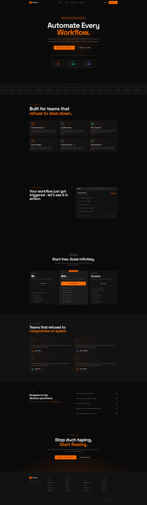

# FlowSync - SaaS Landing Page Template

**A production-ready, full-funnel SaaS landing page built with the latest Next.js, Tailwind CSS v4, Shadcn UI v4, and Motion 12.**

Designed for workflow automation products, but easily adapted for any B2B SaaS, developer tool, or productivity platform. Ships with 10 polished sections, scroll-driven animations, a live execution dashboard mockup, and a complete design system ready to deploy in minutes.

---

## Preview



> Dark brutalist aesthetic · Space Grotesk + IBM Plex Mono · Orange `#FF6B00` accent on near-black

```
Hero → Logo Bar → Features → Dashboard → Pricing → Testimonials → FAQ → CTA → Footer
```

---

## Tech Stack

| Layer            | Technology                                      |
| ---------------- | ----------------------------------------------- |
| Framework        | **Next.js 16** (App Router)                     |
| Component System | **Shadcn UI v4**                                |
| Animations       | **Motion 12** (`motion/react`)                  |
| Font Loading     | **`next/font/google`** — self-hosted, zero FOUC |
| Icons            | **Lucide React**                                |
| Utilities        | **clsx** + **tailwind-merge** via `cn()`        |
| Language         | **TypeScript**                                  |
| Runtime          | **React 19**                                    |

---

## Design System

### Color Palette

| Token                | Value     | Usage                          |
| -------------------- | --------- | ------------------------------ |
| `--fs-bg`            | `#080808` | Page background                |
| `--fs-bg-1`          | `#111111` | Card / section backgrounds     |
| `--fs-bg-2`          | `#1A1A1A` | Elevated card surfaces         |
| `--fs-bg-3`          | `#222222` | Input / tag backgrounds        |
| `--fs-accent`        | `#FF6B00` | Primary CTA, highlights, glow  |
| `--fs-green`         | `#00FF88` | Success states, metric accents |
| `--fs-blue`          | `#4488FF` | Secondary metric accents       |
| `--fs-border`        | `#2A2A2A` | Default borders                |
| `--fs-border-bright` | `#3A3A3A` | Hover / focused borders        |
| `--fs-text`          | `#F0F0F0` | Primary text                   |
| `--fs-text-dim`      | `#888888` | Secondary text                 |
| `--fs-text-dimmer`   | `#444444` | Tertiary / caption text        |

### Typography

| Role             | Font              | Weights                     |
| ---------------- | ----------------- | --------------------------- |
| Display / Body   | **Space Grotesk** | 300 · 400 · 500 · 600 · 700 |
| Monospace / Code | **IBM Plex Mono** | 300 · 400 · 500             |

Both fonts are loaded via `next/font/google` — fully self-hosted at build time. No external font requests. No flash of unstyled text.

### Design Language

- **Aesthetic:** Dark brutalist minimal — high contrast, deliberate whitespace, zero decoration noise
- **Border radius:** `0.5rem` base (`--radius`)
- **Buttons:** Chamfered `.btn-primary` (orange fill) and `.btn-ghost` (transparent + border)
- **Cards:** `.card-fs` — dark surface with subtle orange gradient overlay in `::before`
- **Texture:** SVG noise grain overlay on `<main>` via `.noise-wrap`
- **Grid background:** CSS `background-image` repeating lines on Hero via `.grid-bg`

---

## Sections

### 1. Navbar

**File:** `components/sections/Navbar.tsx`

Sticky, scroll-aware navigation bar. Transparent on load, transitions to a frosted-glass dark surface once the user scrolls past 20px. Includes desktop nav links, sign-in link, and a primary CTA button. Mobile-responsive with an animated hamburger drawer.

**Key details:**

- Logo: Zap icon in an orange square + "FlowSync" wordmark
- Nav links: Product · Pricing · Enterprise · Changelog
- CTA: "Start free →"
- Mobile menu: animated height expand/collapse

---

### 2. Hero

**File:** `components/sections/Hero.tsx`

Full-viewport hero with a radial orange glow behind the headline, decorative horizontal lines, and a 3-metric card row at the base.

**Content:**

- Badge: "New — Introducing FlowSync AI Agents" with pulsing dot
- Headline: "Automate Every / Workflow." (orange glow on "Workflow.")
- Subtext: product value proposition
- Dual CTA: primary + ghost button
- Social proof line: logos of Stripe, Linear, Notion, Figma, Figma, and 49K+ teams
- Metrics row: 10× faster execution · 50K+ teams · 2.4M automations

---

### 3. Logo Bar

**File:** `components/sections/LogoBar.tsx`

Infinite horizontal marquee of integration partner logos. Left and right edges fade to transparent via CSS gradient masks.

**Logos:** Stripe · Linear · Notion · Figma · Vercel · Shopify · Atlassian · Datadog · Twilio · Airtable

---

### 4. Features

**File:** `components/sections/Features.tsx`

Six-card grid showcasing platform capabilities. Each card has a colored icon, title, and description. Border color transitions to the feature's accent color on hover.

**Features:**
| Feature | Accent |
|---|---|
| Visual Flow Builder | Orange |
| AI-Powered Routing | Blue |
| 500+ Integrations | Green |
| Real-Time Execution | Orange |
| Error Recovery | Blue |
| Team Collaboration | Green |

---

### 5. Dashboard (Live Execution Demo)

**File:** `components/sections/Dashboard.tsx`

Split two-column section. Left column has copy. Right column shows a realistic fake execution log UI — a browser chrome mockup with a live workflow step list, status indicators (done / running / pending), execution ID, and a "View full log" link. The right column parallaxes vertically on scroll.

**Workflow steps shown:**

- Trigger: New Stripe charge
- Filter: Amount > $500
- AI: Classify risk level
- Branch: High risk → Slack alert _(running)_
- Branch: Normal → Airtable log _(pending)_

---

### 6. Pricing

**File:** `components/sections/Pricing.tsx`

Three-tier pricing grid. The "Pro" plan is visually highlighted with an orange border and a "Most popular" badge.

| Plan       | Price  | Key limit                         |
| ---------- | ------ | --------------------------------- |
| Starter    | $0/mo  | 1,000 executions · 5 flows        |
| Pro        | $49/mo | 100K executions · Unlimited flows |
| Enterprise | Custom | Unlimited · Private cloud · SSO   |

---

### 7. Testimonials

**File:** `components/sections/Testimonials.tsx`

2×2 grid of customer quotes with large decorative quotation marks, avatar initials, name, and title. Each card uses a colored quotation mark matching the speaker's accent color.

**Speakers:** Head of Ops at Linear · Staff Engineer at Stripe · Platform Lead at Figma · CISO at Datadog

---

### 8. FAQ

**File:** `components/sections/FAQ.tsx`

Two-column layout: editorial copy on the left, accordion on the right. Five questions with animated expand/collapse using `AnimatePresence`.

**Questions:**

- How does the free plan work?
- Can I migrate from Zapier or Make?
- What's your uptime SLA?
- Do you support on-premises deployment?
- What integrations do you support?

---

### 9. CTA

**File:** `components/sections/CTA.tsx`

Full-width dark section with a radial orange glow emanating from the bottom. Large headline, subtext, and dual CTA buttons.

---

### 10. Footer

**File:** `components/sections/Footer.tsx`

Five-column link grid (Product · Company · Developers · Support) + brand column. Bottom bar with copyright and a live "All systems operational" indicator with a pulsing green dot.

---

## Animations

All animations use **Motion 12** (`motion/react`). The project uses a consistent easing curve across all entrance animations:

```ts
ease: [0.16, 1, 0.3, 1]; // Custom spring-like ease — fast in, slow out
```

### Page Load

| Element          | Animation                                     |
| ---------------- | --------------------------------------------- |
| Navbar           | Slides down from `y: -20` + fades in on mount |
| Hero badge       | Fades up from `y: 16`                         |
| Hero headline    | Slides up from `y: 24`, 700ms, spring ease    |
| Hero subtext     | Fades up from `y: 16`, 200ms delay            |
| Hero CTAs        | Fades up from `y: 12`, 300ms delay            |
| Hero metrics row | Staggered fade-up, 100ms between each card    |

### Scroll-Triggered (`useInView` with `once: true`)

Every section below the fold uses `useInView` — animations fire once when the element enters the viewport and do not replay on scroll-back.

| Section          | Trigger         | Animation                                                                          |
| ---------------- | --------------- | ---------------------------------------------------------------------------------- |
| Features header  | Enters viewport | Fade up `y: 24`                                                                    |
| Features cards   | Staggered entry | Each card fades up `y: 32`, `80ms` delay between items                             |
| Features cards   | Hover           | Border color transitions to feature accent                                         |
| Dashboard copy   | Enters viewport | Slides in from left `x: -32`                                                       |
| Dashboard mockup | Enters viewport | Fades up `y: 32` + subtle `rotateX: 8 → 0` perspective tilt                        |
| Dashboard steps  | Staggered entry | Each step slides in from left, `100ms` between                                     |
| Dashboard mockup | Scroll          | Parallax `y` shift `4% → -4%` via `useScroll` + `useTransform`                     |
| Pricing header   | Enters viewport | Fade up                                                                            |
| Pricing cards    | Staggered entry | Each card fades up, `100ms` delay between                                          |
| Testimonials     | Staggered entry | Each card fades up `y: 32`, `100ms` delay                                          |
| FAQ header       | Enters viewport | Fade up                                                                            |
| FAQ accordion    | Click           | `AnimatePresence` — panel expands `height: 0 → auto` + fade in, collapses on close |
| CTA block        | Enters viewport | Fade up `y: 32`                                                                    |

### Continuous / Ambient

| Element                   | Animation                                                     |
| ------------------------- | ------------------------------------------------------------- |
| Logo Bar                  | Infinite horizontal marquee — `x: 0% → -50%`, 25s linear loop |
| Hero badge dot            | CSS `animate-pulse` — pulsing opacity                         |
| Dashboard "Running" badge | CSS `animate-pulse` — pulsing dot                             |

---

## Project Structure

```
lp-saas/
│
├── app/
│   ├── globals.css          # Tailwind v4 CSS-first config, design tokens, components
│   ├── layout.tsx           # Root layout — next/font, metadata
│   └── page.tsx             # Page composition — imports all sections
│
├── components/
│   └── sections/
│       ├── Navbar.tsx        # Sticky nav, scroll-aware blur, mobile drawer
│       ├── Hero.tsx          # Full-viewport hero with metrics
│       ├── LogoBar.tsx       # Infinite marquee logo strip
│       ├── Features.tsx      # 6-card feature grid
│       ├── Dashboard.tsx     # Split layout with live execution mockup + parallax
│       ├── Pricing.tsx       # 3-tier pricing cards
│       ├── Testimonials.tsx  # 2×2 quote grid
│       ├── FAQ.tsx           # Accordion FAQ with AnimatePresence
│       ├── CTA.tsx           # Full-width final CTA
│       └── Footer.tsx        # 5-column footer
│
├── lib/
│   └── utils.ts              # cn() — clsx + tailwind-merge
│
├── postcss.config.mjs        # @tailwindcss/postcss — required for Tailwind v4
└── tsconfig.json             # TypeScript config (path alias @/ → root)
```

---

## Getting Started

### Prerequisites

```bash
node >= 18.17
npm >= 9
```

### Installation

```bash
# 1. Unzip the folder

 npm install
```

### Run the Dev Server

```bash
npm run dev
# → http://localhost:3000
```

---

## Customisation Guide

### Swap the Brand Colors

All brand colors are CSS custom properties in `app/globals.css`. Find the `--fs-*` token block and update:

```css
:root {
  --fs-accent: #ff6b00; /* ← Change to your brand color */
  --fs-accent-dim: rgba(255, 107, 0, 0.13);
  --fs-accent-glow: rgba(255, 107, 0, 0.27);
}
```

### Swap the Fonts

In `app/layout.tsx`, replace the `next/font/google` imports:

```ts
// Before
import { Space_Grotesk, IBM_Plex_Mono } from 'next/font/google';

// After — any Google Font
import { Inter, Fira_Code } from 'next/font/google';
```

Then update the `@theme inline` block in `globals.css`:

```css
@theme inline {
  --font-sans: var(--font-inter), sans-serif;
  --font-mono: var(--font-fira-code), monospace;
}
```

### Edit Section Content

All copy, data arrays, and configuration are defined at the top of each section file as plain TypeScript constants — no CMS, no external config file needed:

```ts
// Features.tsx
const FEATURES = [
  {
    icon: Zap,
    title: 'Your Feature',
    description: 'Your description...',
    color: '#FF6B00',
  },
  // ...
];
```

### Add or Remove Sections

Edit `app/page.tsx` — import and place sections in any order:

```tsx
export default function FlowSyncPage() {
  return (
    <main className='bg-fs-0 noise-wrap'>
      <Navbar />
      <Hero />
      {/* Add, remove, or reorder sections here */}
      <Footer />
    </main>
  );
}
```

---

## Dependencies

### Runtime

```json
{
  "next": "16.x",
  "react": "19.x",
  "react-dom": "19.x",
  "motion": "^12.x",
  "lucide-react": "^0.577.x",
  "clsx": "^2.x",
  "tailwind-merge": "^3.x",
  "class-variance-authority": "^0.7.x",
  "tw-animate-css": "^1.4.x"
}
```

### Dev

```json
{
  "tailwindcss": "^4.x",
  "@tailwindcss/postcss": "^4.x",
  "typescript": "^5.x",
  "@types/node": "^20.x",
  "@types/react": "^19.x",
  "@types/react-dom": "^19.x"
}
```

---

## Browser Support

| Browser       | Version         |
| ------------- | --------------- |
| Chrome / Edge | Last 3 versions |
| Firefox       | Last 3 versions |
| Safari        | 15.4+           |
| Mobile Safari | iOS 15.4+       |

Tailwind v4 uses modern CSS features (`@layer`, `@property`, cascade layers). IE is not supported.

---

## Deployment

This template deploys to any platform that supports Next.js 16:

**Vercel (recommended)**

```bash
npx vercel deploy
```

**Netlify**

```bash
npm run build && npx netlify deploy --dir=.next
```

**Docker / Self-hosted**

```bash
npm run build
npm start
```

---

## What's Included

```
✅ 10 fully-coded sections
✅ Tailwind v4 CSS-first design system
✅ Complete color token system (--fs-* custom properties)
✅ Space Grotesk + IBM Plex Mono via next/font (zero FOUC)
✅ Motion 12 scroll animations on every section
✅ Infinite marquee logo bar
✅ Parallax scroll effect on Dashboard section
✅ AnimatePresence accordion FAQ
✅ Scroll-aware frosted-glass navbar
✅ Mobile-responsive layout (all breakpoints)
✅ Accessible focus states and keyboard navigation
✅ Custom scrollbar styling
✅ SVG noise texture overlay
✅ CSS grid background on Hero
✅ TypeScript throughout
✅ cn() utility (clsx + tailwind-merge)
✅ Correct postcss.config.mjs for Tailwind v4
✅ Production-ready — deploys to Vercel in one command
```

---

## License

**Commercial License — Single Product**

By purchasing this template you are granted a **non-exclusive, non-transferable license** to use this template in **commercial or personal project**.

### You May ✅

- Use this template to build a website or SaaS product for yourself or a client
- Modify the design, content, components, and styles to fit your brand
- Deploy the project to any hosting platform
- Use the deployed site commercially (sell products, run ads, generate revenue)

### You May Not ❌

- Resell, redistribute, or re-license the template source code
- Share the source files publicly (GitHub, GitLab, open-source repositories)
- Include the template in a bundle, marketplace listing, or template collection
- Claim authorship of the original template design

---

## Support

If you have questions about setup, customisation, or encounter a bug, please reach out:

---

## Changelog

### v1.0.0 — Initial Release

- 10 sections: Navbar, Hero, LogoBar, Features, Dashboard, Pricing, Testimonials, FAQ, CTA, Footer
- Tailwind v4 CSS-first architecture
- Motion 12 scroll and entrance animations
- Next.js 16 + React 19 + Shadcn UI v4
- Space Grotesk + IBM Plex Mono via next/font/google

---

_FlowSync Landing Page Template — built by [Your Name / Studio]. Made for founders, indie hackers, and agencies who ship fast._
